INSTALLATION GUIDE

When downloaded, the game will appear as a .ZIP file.

1.  Using either your operating system’s file extraction tool or an external
    tool such as WinZip, extract the .ZIP file to a target folder.

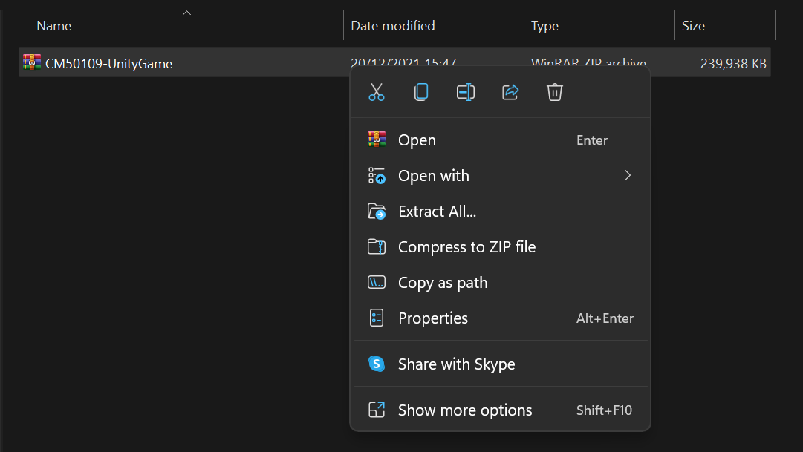

1.  Open the folder to which the files were extracted and run the application
    file ‘House of Creation’. If you would like, you can create a desktop
    shortcut for this file using your operating system’s shortcut creation tool.

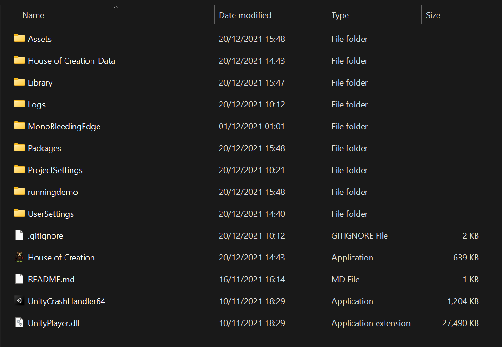

1.  The game should launch, displaying the unity logo followed by the title
    screen. Enjoy playing House of Creation!

USER MANUAL

-   The user needs to install the game using the instructions mentioned. Once
    the game is installed, the user is all set to play the game.

    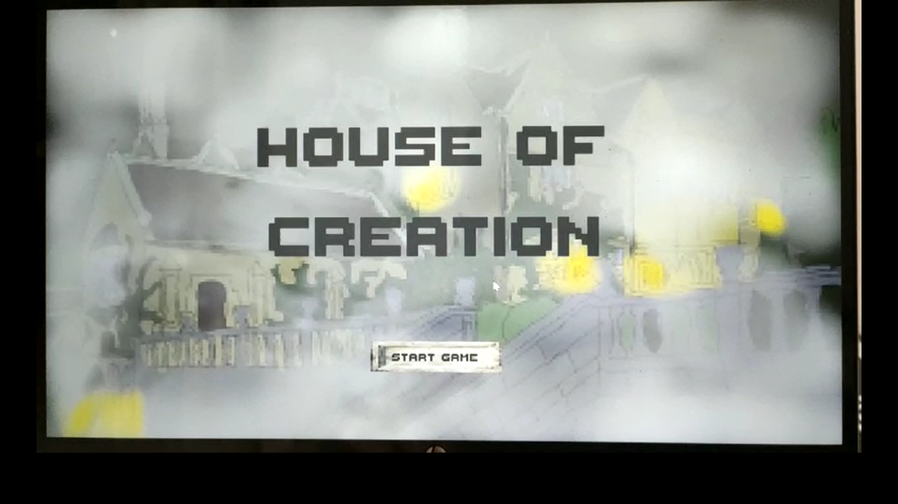

-   This is the start screen, from here the user can select “start game” to
    enter the game

    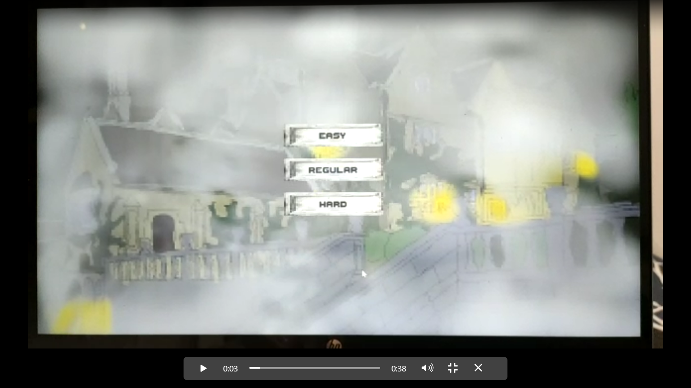

-   This is the difficult select screen, the user can pick a difficulty, but be
    careful - the harder difficulties are much more difficult

-   Once the difficulty has been selected by the user, the research notes
    (tutorial) is displayed. It includes instructions on how to play the game,
    move and attack.

-   You begin in the monster creation menu; you are a dark wizard who can create
    monsters to help you by combining parts on the monster creation table  
    
    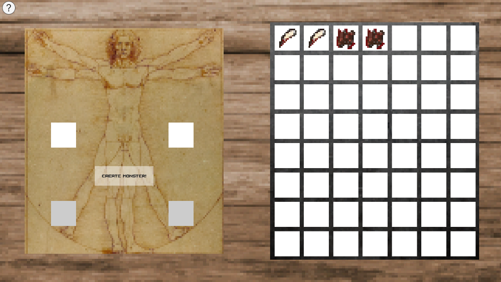

-   You can select monster parts by clicking on them on the right to select
    them. You can also deselect

-   You’ll come across multiple different monster parts as you make your way
    through the game each one will give your monster different abilities,
    changing how fast they can move, how powerful they are and how much health
    they have. If you’re lucky you may even be able to find monster parts that
    give you the special abilities of the enemies, you face...

-   Once you have made your monster you then enter the combat part of the game
    as you control your monsters to fight off against hordes of mythical
    creatures who are trying to get to you

-   There is a tutorial stage where you will go up against one or two enemies
    depending on your difficulty to get you used to the controls. A
    comprehensive list of the relevant controls is included below:

-   ESC – access a menu that allows you to quit the game

-   ENTER – press this button at the end of your turn to switch it to the
    enemy’s turn and vice versa, the turn indicator will let you know whose turn
    it is

-   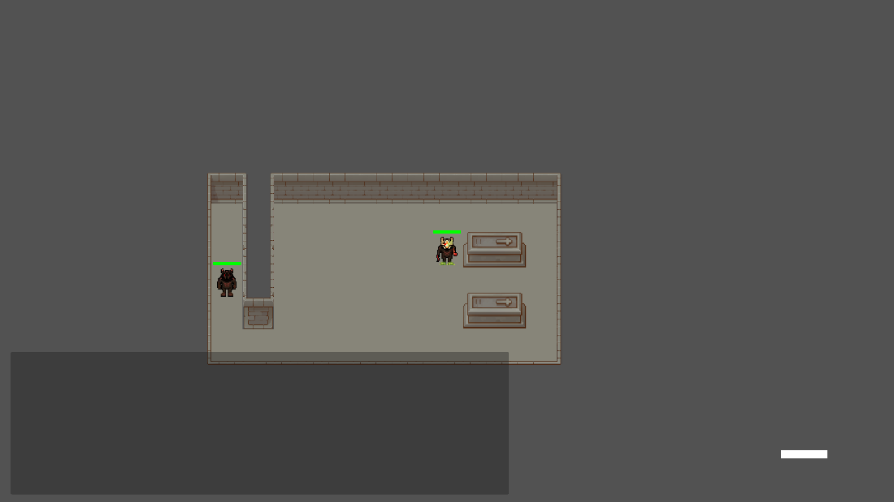  
    
    WHITE indicates that it is your turn

-   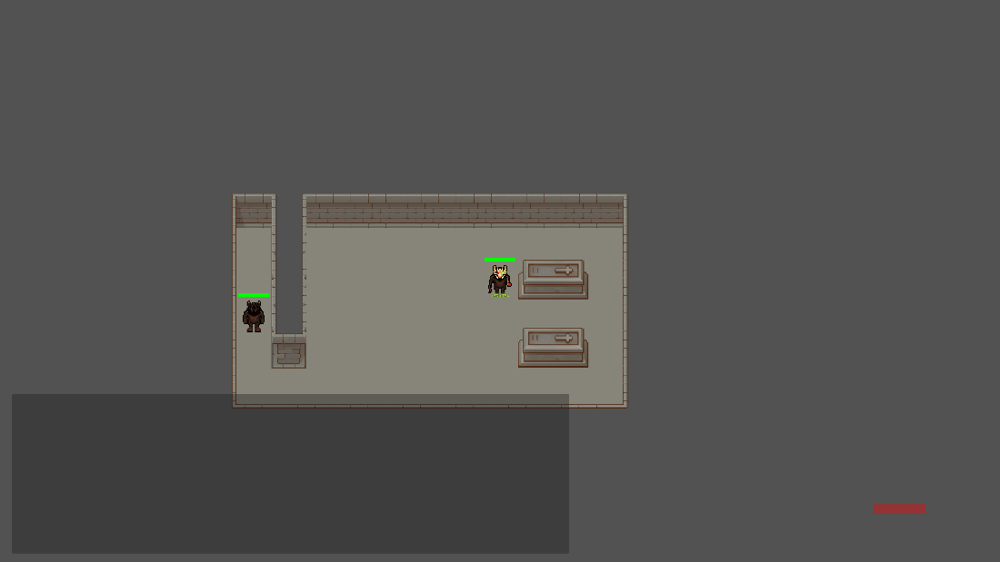  
    
    RED indicates that it is the enemies’ turn

-   CAMERA button – this will be a button on screen that will zoom out and allow
    you to see the whole map

-   W – this will let you pan the camera upwards

-   A – this will let you pan the camera left

-   S - this will let you pan the camera downwards

-   D - this will let you pan the camera left

-   MOUSE LEFT – you can click on your monster to select it, and once you have
    selected a monster you can click an adjacent highlighted tile to move it -
    your monsters will only have a certain amount of movement each turn so use
    it carefully!

-   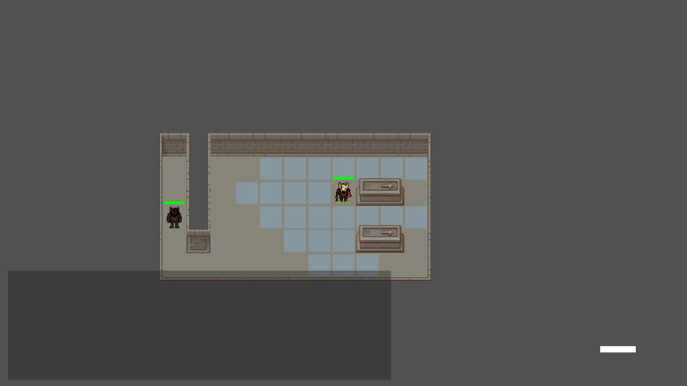

-   If your monster is adjacent to an enemy, you can left click the enemy to
    damage it, most monsters can only attack one enemy per turn so keep this in
    mind!  
    
    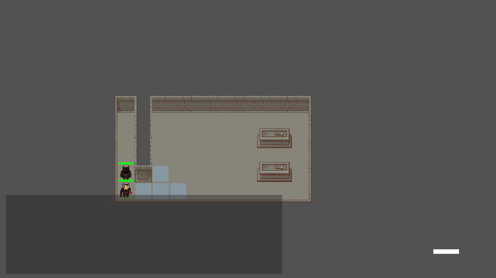

-   Once you have defeated all the enemies on the level, you will finish the
    level and go to the progress screen where you can either move on to the next
    level or quit the game  
    
    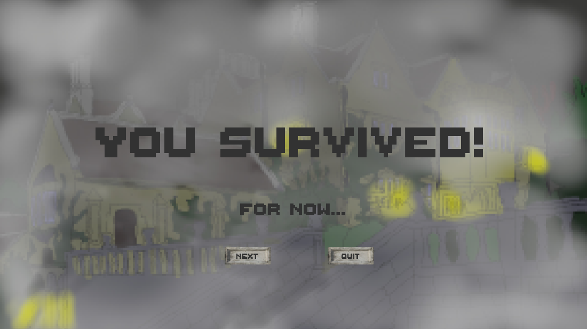

-   As you progress through each level, you’ll face new enemies, tougher than
    the ones you’ve faced before and unlock more of the house to explore

-   Occasionally you’ll enter the monster creation screen again and you can make
    new monsters with the parts you’ve collected. Your parts will decay between
    creation stages, so use them quickly

-   Here is an example of some of the enemies you’ll face:   
    
    THE WEREWOLF:   
    
    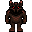  
    
    The most basic enemy, they usually come in groups and attack you with their
    bite. They don’t have any special abilities.  
    
    THE SPIDER:   
    
    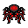  
    
    A much faster enemy, they’ll slow you down if they hit get close enough to
    entangle you in their webs! Maybe you could do the same if you get a spider
    part...

-   And here is an example of some of the rooms you’ll come across:

-   

-   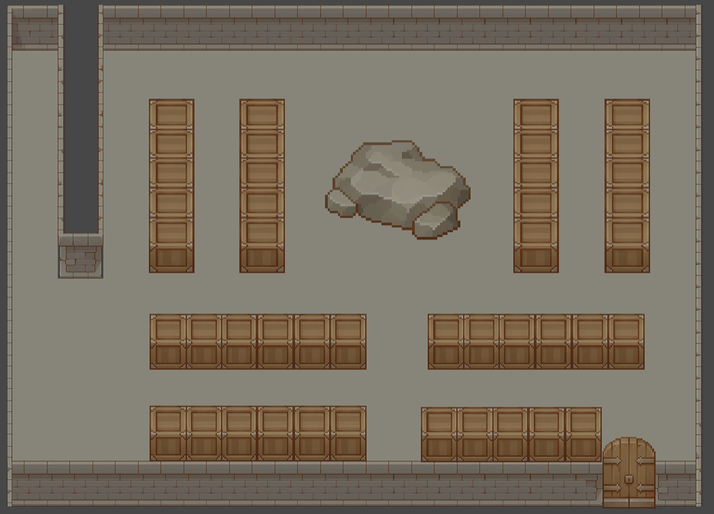

-   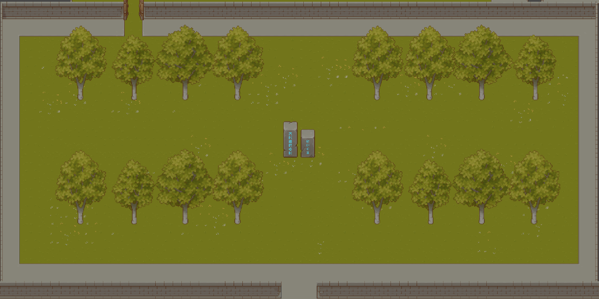

-   Good luck on your journey, and see if you can manage to explore the whole
    house and defeat the mastermind behind the onslaught of enemy attacks...
